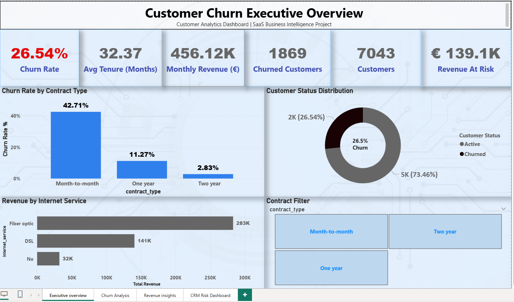
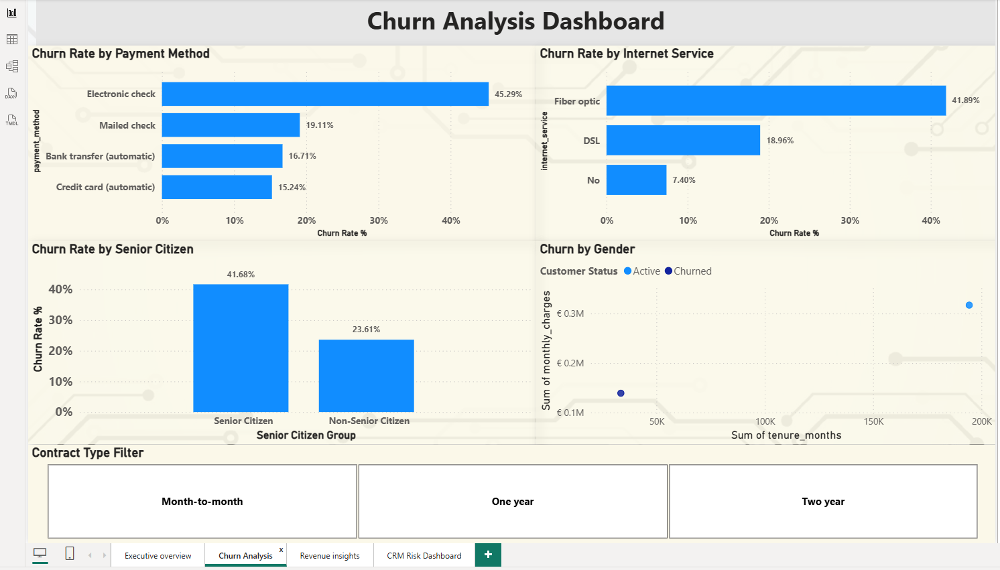
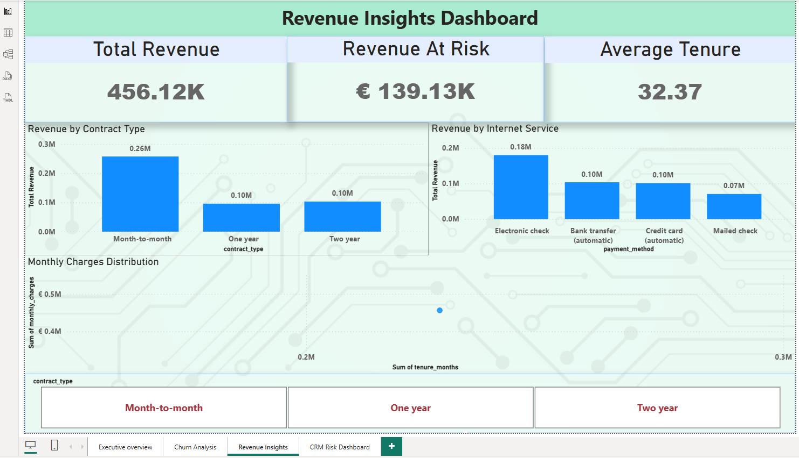
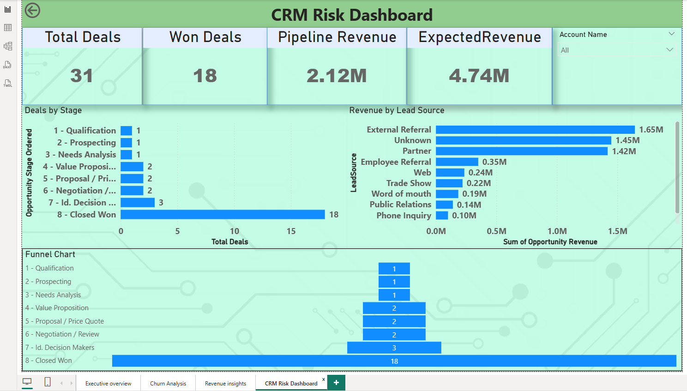

# 📊 SaaS Customer Churn Analytics Project

## 🚀 Overview

This project analyzes customer churn behavior in a telecom/SaaS business and provides insights into customer retention, revenue risk, and sales pipeline performance.

It demonstrates an **end-to-end data analytics pipeline** using:

* SQL (data modeling)
* Python (ETL + EDA)
* Power BI (dashboarding)

---

## 🎯 Business Objectives

* Identify customers likely to churn
* Analyze revenue impact due to churn
* Understand customer behavior patterns
* Provide actionable insights for CRM teams

---

## 🏗️ Project Architecture

```
Raw Dataset (CSV)
        ↓
SQL Server (Star Schema Model)
        ↓
Python ETL & Data Enrichment
        ↓
CRM Enriched Dataset
        ↓
Power BI Dashboards
```

---

## 🧱 Data Model

### Dimension Tables

* `dim_customer`
* `dim_service`
* `dim_contract`

### Fact Table

* `fact_customer_metrics`

### Enriched Dataset

* `crm_enriched_data`

---

## ⚙️ Technologies Used

* Python (Pandas, NumPy)
* SQL Server
* Power BI
* Data Modeling (Star Schema)

---

## 📊 Key Insights

* 📉 Churn Rate: **26.54%**
* ⚠️ Month-to-month contracts have highest churn (**42%+**)
* 💰 Revenue at Risk: **€139K**
* 👥 New & short-tenure customers churn more
* 💸 Higher monthly charges correlate with churn

---

## 📈 Dashboards

### 🔹 Executive Overview



---

### 🔹 Churn Analysis Dashboard



---

### 🔹 Revenue Insights Dashboard



---

### 🔹 CRM Risk Dashboard



---

## 🧠 Key Features

* End-to-end analytics pipeline
* Star schema data modeling
* KPI tracking (Churn, Revenue, Risk)
* Customer segmentation
* CRM-ready insights

---

## 📂 Project Structure

```
data/
notebooks/
scripts/
dashboards/
docs/images/
README.md
```

---

## 📌 Future Improvements

* Machine learning churn prediction model
* Real-time data pipeline integration
* Salesforce live integration

---

## 👨‍💻 Author

**Gnaneshwar Sreepathi**
